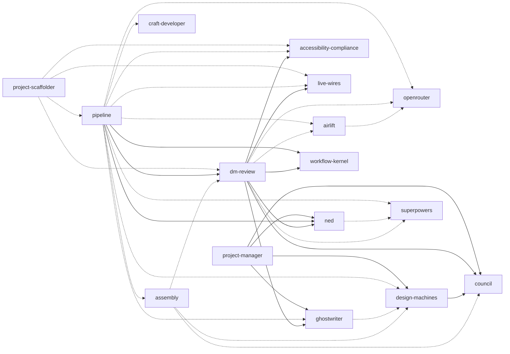

# Plugin Dependency Graph

Generated by `./tools/check-dependencies.sh --graph`. Do not edit manually.

```mermaid
graph LR
  airlift -.-> openrouter
  assembly -.-> council
  assembly -.-> design-machines
  assembly -.-> dm-review
  design-machines --> council
  dm-review --> accessibility-compliance
  dm-review --> live-wires
  dm-review --> ghostwriter
  dm-review --> council
  dm-review --> ned
  dm-review --> workflow-kernel
  dm-review -.-> superpowers
  dm-review -.-> airlift
  dm-review -.-> openrouter
  ghostwriter -.-> design-machines
  ned -.-> superpowers
  pipeline --> dm-review
  pipeline --> ned
  pipeline --> workflow-kernel
  pipeline -.-> design-machines
  pipeline -.-> assembly
  pipeline -.-> live-wires
  pipeline -.-> craft-developer
  pipeline -.-> accessibility-compliance
  pipeline -.-> ghostwriter
  pipeline -.-> superpowers
  pipeline -.-> airlift
  pipeline -.-> openrouter
  project-manager --> ned
  project-manager --> design-machines
  project-manager --> ghostwriter
  project-manager --> council
  project-scaffolder -.-> live-wires
  project-scaffolder -.-> dm-review
  project-scaffolder -.-> pipeline
  project-scaffolder -.-> accessibility-compliance
```
