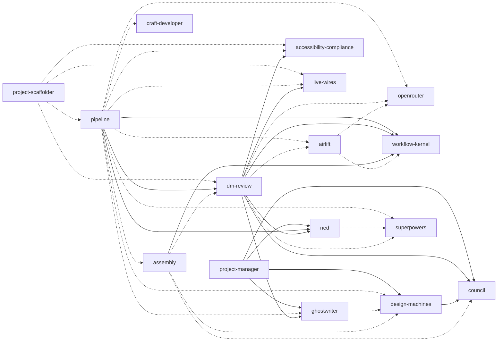

# Plugin Dependency Graph

Generated by `./tools/check-dependencies.sh --graph`. Do not edit manually.

## Declared Version Floors

| Consumer | Dependency | Type | Required floor |
|---|---|---|---|
| airlift | openrouter | optional | `>=1.8.0` |
| airlift | workflow-kernel | optional | `>=0.5.0` |
| assembly | workflow-kernel | required | `>=0.6.1` |
| assembly | council | optional | `>=1.5.0` |
| assembly | design-machines | optional | `>=1.3.0` |
| assembly | dm-review | optional | `>=1.35.0` |
| design-machines | council | required | `>=1.9.0` |
| dm-review | accessibility-compliance | required | `>=1.2.0` |
| dm-review | live-wires | required | `>=1.8.0` |
| dm-review | ghostwriter | required | `>=3.7.0` |
| dm-review | council | required | `>=1.5.0` |
| dm-review | ned | required | `>=1.4.0` |
| dm-review | workflow-kernel | required | `>=0.5.0` |
| dm-review | superpowers | optional | `>=1.0.0` |
| dm-review | airlift | optional | `>=1.0.0` |
| dm-review | openrouter | optional | `>=1.8.0` |
| ghostwriter | design-machines | optional | `>=1.5.0` |
| ned | superpowers | optional | `>=1.0.0` |
| pipeline | dm-review | required | `>=1.48.0` |
| pipeline | ned | required | `>=1.4.0` |
| pipeline | workflow-kernel | required | `>=0.7.0` |
| pipeline | design-machines | optional | `>=1.3.0` |
| pipeline | assembly | optional | `>=3.9.1` |
| pipeline | live-wires | optional | `>=1.8.0` |
| pipeline | craft-developer | optional | `>=1.0.0` |
| pipeline | accessibility-compliance | optional | `>=1.2.0` |
| pipeline | ghostwriter | optional | `>=3.7.0` |
| pipeline | superpowers | optional | `>=1.0.0` |
| pipeline | airlift | optional | `>=1.0.0` |
| pipeline | openrouter | optional | `>=1.8.0` |
| project-manager | ned | required | `>=1.4.0` |
| project-manager | design-machines | required | `>=1.3.0` |
| project-manager | ghostwriter | required | `>=3.7.0` |
| project-manager | council | required | `>=1.5.0` |
| project-scaffolder | live-wires | optional | `>=1.0.0` |
| project-scaffolder | dm-review | optional | `>=1.0.0` |
| project-scaffolder | pipeline | optional | `>=1.0.0` |
| project-scaffolder | accessibility-compliance | optional | `>=1.0.0` |
